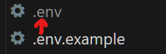
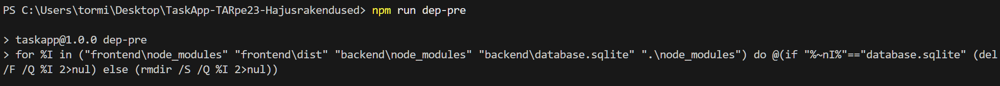
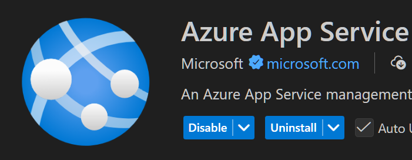
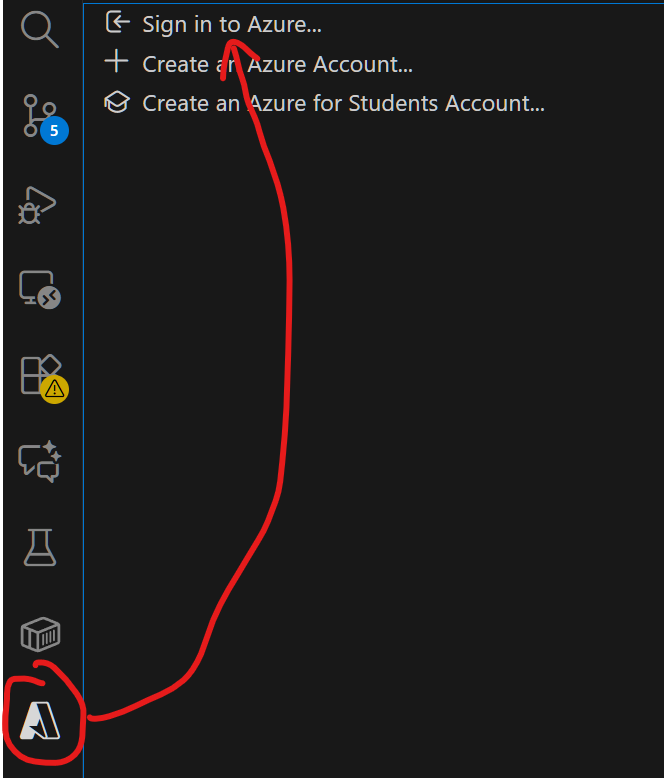
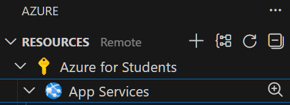
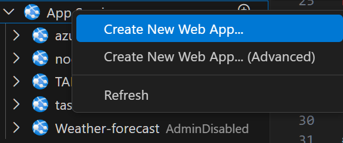
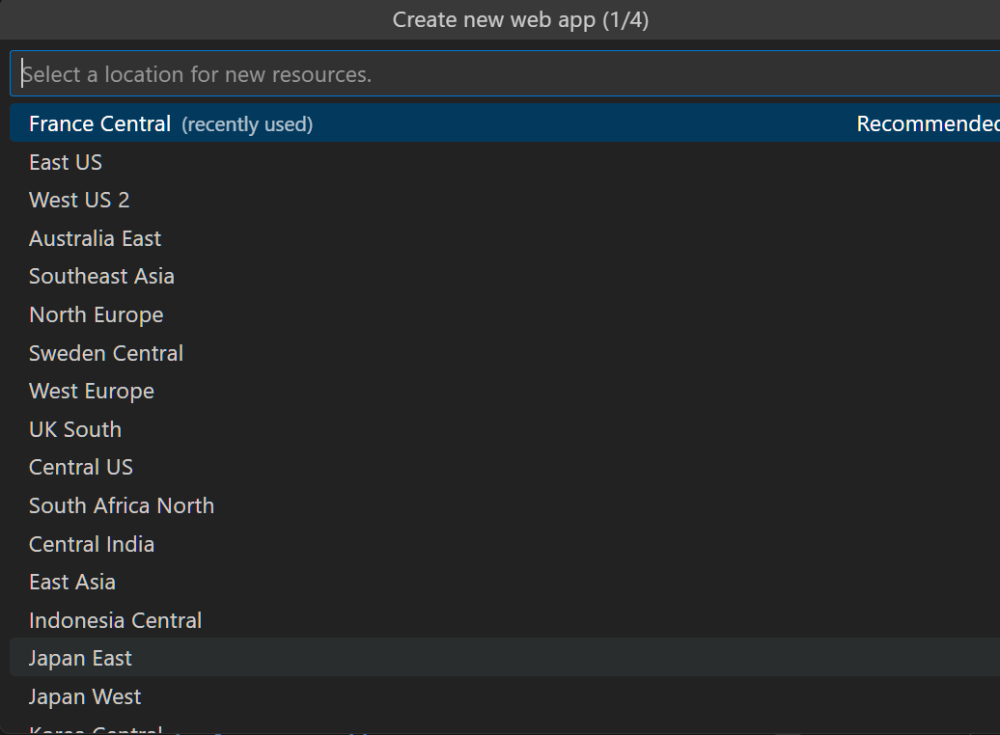
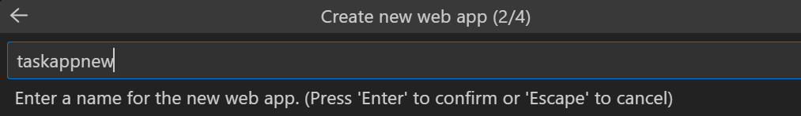
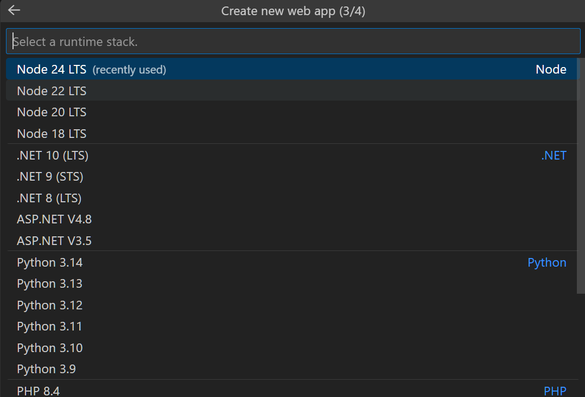
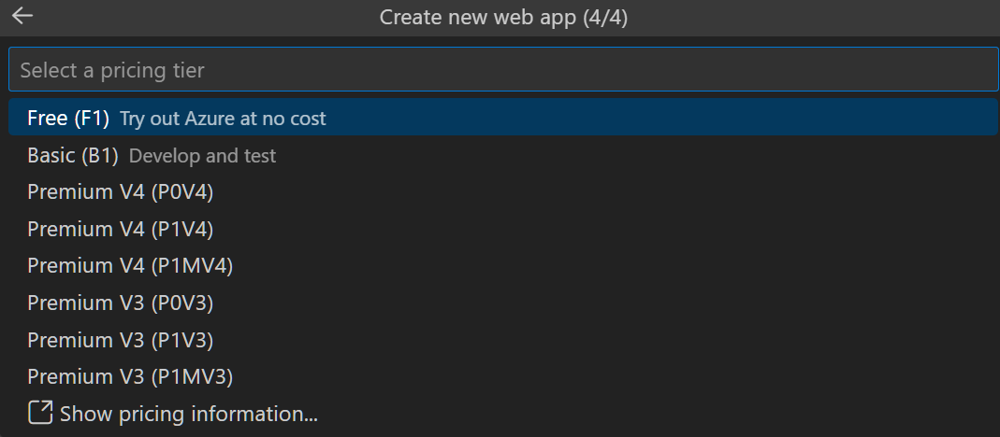

Hajusrakenduste projekt:

Taskapp projekt, kus on CRUD operatsioonid ülesannete (taskide) jaoks.

Tegijad:
Tormi Laane
Mel Kosk

Õpetaja: Kristjan Kivikangur

Projektihalduslink: https://trello.com/invite/b/68f0a812968004ea9423e498/ATTI4d0920a19c01a049a8a539f0610cc32c63E12EF7/taskapp-tormilaane-melkosk

## Projekti käivitamine

Mine kausta backend ja nimeta ümber .env.example -> .env

Siis täida .env fail sobivate andmetega

Mine kausta frontend ja nimeta ümber .env.example -> .env

Siis täida .env fail sobivate andmetega

Peale kloonimist minna kloonitud kausta ja käivitada käsk:
"npm install"
Projekti käivitamiseks anda käsk:
"npm start"

Projekt töötab ja kuvab veebilehed, millelt saab lehte külastada.
Lõpetamiseks vajuta klahve CTRL+C

## Azure Evitus
1. **Tee kindlaks, et .env.example on nimetatud ringi .env'iks  (Frontend ja backend kaustades) **

2. Käivita käsklus "**npm run dep-pre**", et puhastada repo.

3. Installi "**Azure App Service**" plugin Visual Studio Code's

4. Logi enda kontoga sisse

5. Parem klõpsa "**App Services**"

6. Vali "**Create New Web App**"

7. Vali ressursi asukoht (Soovitan "Recommended" asukohta)

8. Pane unikaalne nimi "taskapp" või midagi muud

9. Vali "**Node 24 LTS**" runtime stack

10. Vali "**Free**" või "**Basic**"

11. Oota kuni service on loodud
12. Parem klõpsa loodud service peal
13. Klikka "**Deploy to Web App**"
14. Vali ülevalt aknast taskapp repo
15. Oota kuni see on evitatud ja valmis ehitatud, **see võtab natukene aega (2-10 minutit)**
16. Parem klõps sinu loodud service peal
17. Klikka "**Browse Website**"
18. Nüüd peaks projekt olema evitatud Azure keskkonnas

## Azure Probleemide lahendus
1. Andmebaas ei töötanud, pidi selle ära kustutama
2. Deploy ei töödanud kuna node_modules eksisteeris, selle pidi ära kustutama
3. Ressurssi asukoha probleem, Azure veebi keskkonnas pidi vaatama "recommended locations"